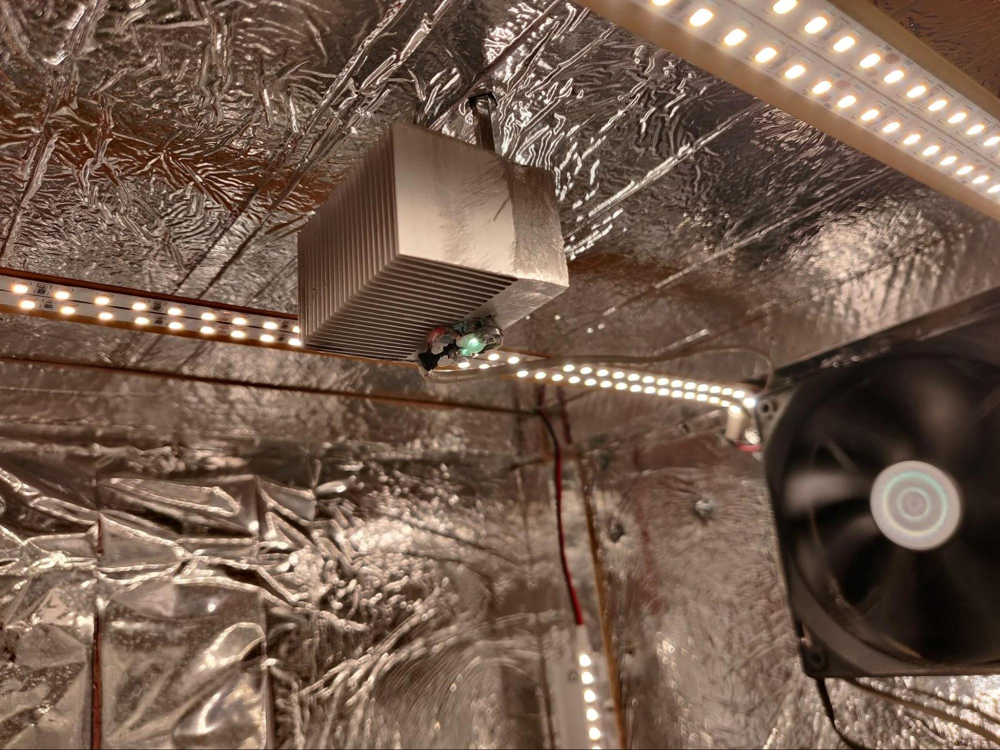

<h1>Projekta darba apraksts</h1>

## Autonomā siltumnīca

Siltumnīcas plāns bija uzstaisīt, lai siltumnīca varētu regulēt gaismas režīmu, klimatu, laisīšanu, un visus sensoru datus ierakstīt.


Siltumnīcas izmēri ir 45x45x80cm.

Siltumnīcā patreiz aug salāts, pipermēta, cūku pupas, citornzāle, pārziemota paprika.


Siltumnīcas galvenais vadības elements ir ESP32 mikrokontrolers, kam papildus ir Rasperry Pi Zero, kas uzņem foto atēlus priekš timelapse video


Visi vadi ir nenoslēgti prototipēšanas nolūkam, lai āti varētu kaut ko samainīt vai diagnosticēt.

Timelapse video 2 nedēlu periodā:

[https://youtu.be/QADKhDMOnyU](https://youtu.be/QADKhDMOnyU)

Siltumnīcā sensori:

<table>
  <tr>
   <td>


   </td>
   <td>


   </td>
  </tr>
  <tr>
   <td>AM2320
<p>
Mēra siltumnīcas iekšējo temperatūru un relatīvo gaisa mitrumu
   </td>
   <td>BMP280 mēra arējo temperatūtu un gaisa mitrumu
   </td>
  </tr>
  <tr>
   <td>


   </td>
   <td>
   </td>
  </tr>
  <tr>
   <td>Kapacatīvais un pretestības augsnes mitruma senori + augnes temperatūras sensors
   </td>
   <td>
   </td>
  </tr>
</table>


Sensorus mēģināju kalibrēt izžāvējot augsni tad un pakāpeniski to mitrinot, novēroju ekponencionālas izmaiņas starp lasījumiem, tad attiecīgi ar Python skriptu mēģināju pielāgot līknes pie datiem.


Visi izpildes elementi tiek vadīti vai no bipolārlajiem vai MOSFET tranzistoriem


Siltumnīcas izplides elementi:


<table>
  <tr>
   <td>


   </td>
   <td>


   </td>
  </tr>
  <tr>
   <td>Ūdens sūknis
   </td>
   <td>24V baltās krāsas gaismas, 360nm UV gaisma, + 3 ventilatori.
   </td>
  </tr>
  <tr>
   <td>


   </td>
   <td>


   </td>
  </tr>
  <tr>
   <td>2  12v sildelementi virknē.
   </td>
   <td>Ultraskaņas atomizators - gaisa mitrinātājs
   </td>
  </tr>
</table>


Gaisa temperatūras un mitruma regulēšanas shēma:

l


VPD(Vapor Pressure Deficit) ir aprēķināta vērtība no gaisa mitruma un temperatūras, kas ir labs radītājs augam vēlamiem augšanas apstakļiem relatīvi gaisa temperatūrai.

Tabula ieskatam:


Siltumnīcas sensoru dati tiek nosūtīti caur internetu uz InfluxDB mākoņa datubāzi:


ESP32 programma publicēta GitHub, programmēšanai izmantoju VSCode ar PlatformIO extension, ESP32 parasti programēju OTA(Over-the-air) caur WiFi tīklu:

[https://github.com/Jurgols/siltumnica32](https://github.com/Jurgols/siltumnica32/blob/master/src/main.cpp)


Raspberry Pi foto ar intervālu tiek uzņeti caur Python valodā rakstītu skriptu, kas uz linux darbojās, kā servis.


 

Pašus timelapse video veidoju ar ffmpeg programmu:


```ffmpeg -framerate 24 -pattern_type glob -i "~/Pics/*jpg" -s:v 1920:1440 -c:v libx264 -crf 17 -pix_fmt yuv420p ~/Video/siltumnica_timelapse.mp4```


Timelapse video 1 mēneša periodā:

[https://youtu.be/B2gj5SM8boA](https://youtu.be/B2gj5SM8boA)
